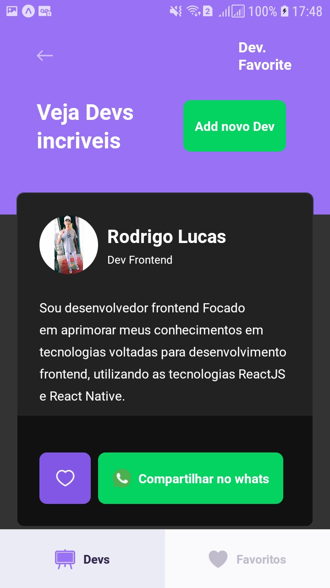
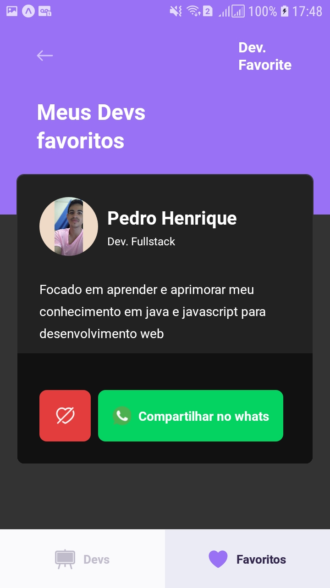
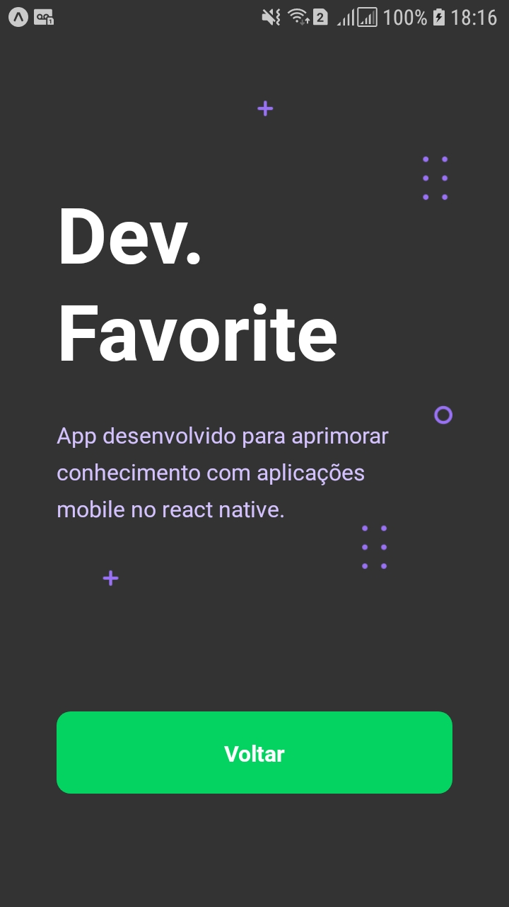

<h1 align="center">
    <a href="#" alt="App mobile Dev Favorite"> Dev. Favorite </a>
</h1>

<h3 align="center">
    Com Dev. Favorite podemos cadastrar Devs e compartilhar os dados no whatsapp
</h3>


<h4 align="center">
	🚧   Concluído 🚀 🚧
</h4>

## 💻 Sobre o projeto

Dev Favorite - é uma forma incentivar novas pessoas a se aventurar na carreira do 
desenvolvimento mobile.

---

## ⚙️ Funcionalidades

- [x] O usuário podem cadastrar um novo Dev
  - [x] O aplicativo faz uma listagem de todos os Devs cadastrados
  - [x] O usuário pode favoritar um Dev
  - [x] E possivel compartilhar as informações do Dev cadastrado pelo whatsapp
---

### Mobile

<p align="center">
  
  
  
  
  
</p>
---

## 🚀 Como executar o projeto

Este projeto é divido em duas partes:
1. Backend (pasta server) 
2. Mobile (pasta mobile)

💡Para o app mobile funcione perfeitamente e necessario que o backend já esteja 
executando

### Pré-requisitos

Antes de começar, você vai precisar ter instalado em sua máquina as seguintes ferramentas:
[Git](https://git-scm.com), [Node.js](https://nodejs.org/en/). 
Além disto é bom ter um editor para trabalhar com o código como [VSCode](https://code.visualstudio.com/)

#### 🎲 Rodando o Backend (servidor)

```bash

# Clone este repositório
$ git clone git@github.com:Rodrigo322/DevFavorite.git

# Acesse a pasta do projeto no terminal/cmd
$ cd README-devFavorite

# Vá para a pasta backend
$ cd backend

# Instale as dependências
$ npm install

# Execute a aplicação em modo de desenvolvimento
$ npm run start

# O servidor inciará na porta:3333 - acesse http://localhost:3333 

```
#### 🧭 Rodando a aplicação mobile (Frontend)

```bash

# Clone este repositório
$ git clone git@github.com:Rodrigo322/DevFavorite.git

# Acesse a pasta do projeto no seu terminal/cmd
$ cd README-devFavorite

# Vá para a pasta da aplicação Front End
$ cd mobile

# Instale as dependências
$ npm install

# Execute a aplicação em modo de desenvolvimento
$ npm run start

# A aplicação será aberta na porta:3000 - acesse http://localhost:3000

```

---

## 🛠 Tecnologias

As seguintes ferramentas foram usadas na construção do projeto:

#### [](https://github.com/Rodrigo322/DevFavorite)**Backend**  ([NodeJS](https://nodejs.org/en/) 

-   **[Express](https://expressjs.com/)**
-   **[CORS](https://expressjs.com/en/resources/middleware/cors.html)**
-   **[Sequelize](https://sequelize.org/)**
-   **[MySql2](https://www.npmjs.com/package/mysql2)**

#### [](https://github.com/Rodrigo322/DevFavorite)**Mobile**  ([React Native](http://www.reactnative.com/)  +  [TypeScript](https://www.typescriptlang.org/))

-   **[Expo](https://expo.io/)**
-   **[React Navigation](https://reactnavigation.org/)**
-   **[Axios](https://github.com/axios/axios)**

## 📝 Licença

Este projeto esta sobe a licença [MIT](./LICENSE).